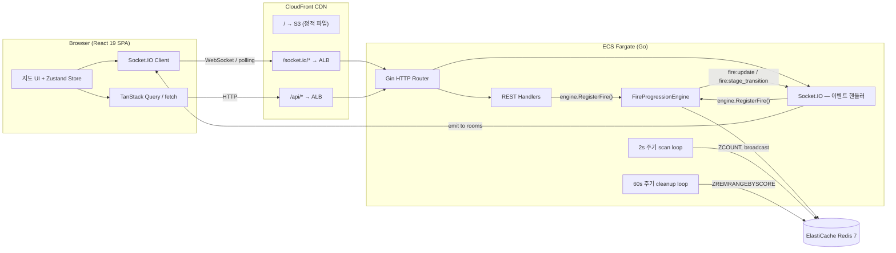
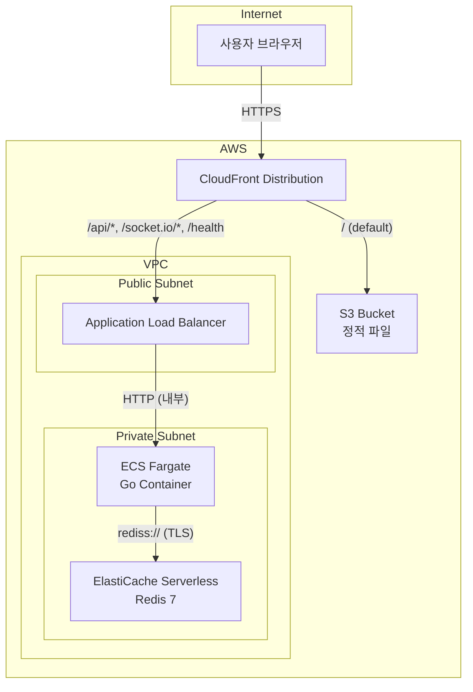

# 아키텍처 개요

화르르(hwarr)는 GPS 기반 실시간 불 지도 웹 서비스이다. 사용자가 지도 위를 탭하면 해당 좌표에 "불"이 붙고, 같은 격자(grid cell)에 불이 쌓일수록 단계가 올라가며, 일정 시간이 지나면 자동 소멸한다. 모든 상태 변화는 접속 중인 전체 클라이언트에 실시간으로 전파된다.

이 문서는 시스템이 **왜 이런 구조를 택했는지**에 초점을 맞춘다. API 명세나 Redis 키 설계 등 세부 참조는 `docs/reference/` 디렉터리를 참고한다.

---

## 1. 시스템 전체 구조



### 핵심 설계 의도

| 결정 | 이유 |
|------|------|
| **단일 프로세스에 REST + WebSocket 통합** | 해커톤 규모에서 마이크로서비스 분리는 오버 엔지니어링이다. Gin 라우터가 REST 요청을 처리하고, Engine.IO/Socket.IO 서버가 WebSocket을 처리한다. 하나의 Go 바이너리로 두 프로토콜을 서빙한다. |
| **Redis를 유일한 상태 저장소로 사용** | Sorted Set의 score에 만료 시각을 넣으면 TTL 기반 자동 소멸이 `ZCOUNT`/`ZREMRANGEBYSCORE`만으로 구현된다. 별도 DB 없이 불 이벤트의 생성-조회-소멸 전체 수명 주기를 다룰 수 있다. |
| **FireProgressionEngine을 in-process goroutine으로 실행** | 외부 스케줄러 대신 goroutine으로 2초 간격 스캔 루프를 돌린다. 같은 프로세스이므로 Redis 커넥션과 Socket.IO broadcaster를 직접 참조해 지연 없이 broadcast할 수 있다. |

---

## 2. 서버 아키텍처

### Gin 라우터 구조

```
Gin Router (http.Server)
├── /socket.io/*  → Engine.IO Server → Socket.IO Server
├── /api/grid/:grid_id, /api/grid/viewport  (handler.GridHandler)
├── /api/ranking/today                       (handler.RankingHandler)
├── /api/news, /api/qr, ...                 (기타 handlers)
├── /api/feedback, /api/demo/*               (handler.FeedbackHandler 등)
└── /health                                  (ALB health check)
```

Gin 라우터가 모든 HTTP 요청을 받고, `/socket.io/*` 경로는 Engine.IO 서버로 위임하여 WebSocket 연결을 처리한다. 하나의 Go 바이너리로 HTTP와 WebSocket을 동시에 서빙한다.

### Startup / Shutdown 순서

**Startup** (`server.Run()`):

1. Redis 연결 (`go-redis` client) 및 `Ping()` 확인
2. Socket.IO + Engine.IO 서버 생성
3. `sio.NewHandler()` — ConnectionManager 초기화 및 Socket.IO 이벤트 핸들러 등록
4. `geodata.LoadOrNil()` — 행정동 GeoJSON 로드 (일별 랭킹용, optional)
5. Background goroutine 시작: FireProgressionEngine(2s), CleanupEngine(60s)
6. `sio.NewReaper()` — stale connection 감지 goroutine 시작
7. Gin HTTP 서버 시작

Redis 연결 실패 시 engine 없이 기동한다. health check 엔드포인트는 항상 응답하므로 ALB가 컨테이너 상태를 판단할 수 있다.

**Shutdown** (OS signal 수신 시):

1. `http.Server.Shutdown()` — graceful HTTP 서버 종료 (10s timeout)
2. Background goroutine 정리 (context cancellation)

### Socket.IO 설정

Engine.IO 서버에서 ping interval 10초, ping timeout 5초로 설정한다.

빠른 disconnect 감지를 위해 기본값보다 공격적인 값을 사용한다. 실시간 불 지도에서 "유령 연결"이 남으면 `users:count`가 부정확해지기 때문이다. 클라이언트 측 heartbeat(10s)와 서버 reaper(30s timeout)가 이중 안전망 역할을 한다.

---

## 3. 클라이언트 아키텍처

### 컴포넌트 트리

```
<QueryClientProvider>         ← TanStack Query (REST 캐시)
  <SocketProvider>            ← 전역 소켓 1회 연결
    <RouterProvider>          ← TanStack Router (파일 기반 라우팅)
      <MapPage />
      <RankingPage />
      ...
```

### 주요 라이브러리 선택 이유

| 라이브러리 | 역할 | 선택 이유 |
|-----------|------|----------|
| **React 19** | UI 렌더링 | 최신 concurrent features, Suspense 통합 |
| **TanStack Router** | 클라이언트 라우팅 | 파일 기반 route 생성(`routeTree.gen.ts`), type-safe params |
| **TanStack Query** | REST API 캐시 | viewport 조회 등 HTTP 요청의 캐시/재검증 자동화 |
| **Zustand** | 전역 상태 관리 | Socket 연결 상태(`useSocketStore`)를 React 외부에서도 읽고 쓸 수 있다. Redux 대비 보일러플레이트가 거의 없다. |
| **Socket.IO Client** | 실시간 통신 | 자동 재접속, polling→WebSocket 업그레이드, 서버 Socket.IO와 프로토콜 일치 |
| **Leaflet + react-leaflet** | 지도 렌더링 | 오픈소스, 가벼움, 타일 기반 grid 시스템과 자연스럽게 호환 |

### Socket 수명 주기 (`socketManager.ts`)

소켓은 앱 전체에서 **단일 인스턴스**로 관리된다.

1. `SocketProvider`가 mount 시 `startSocket()`을 1회 호출 (`started` 가드로 StrictMode 이중 마운트 방어)
2. `io(SOCKET_URL, { autoConnect: false })` — 생성은 모듈 로드 시, 연결은 명시적 `connect()` 호출 시
3. 연결 성공 시 10초 간격 heartbeat 시작, Zustand store에 `status: 'connected'` 기록
4. 서버 disconnect 시 자동 재접속 (최대 8회, 500ms~5s exponential backoff)
5. `io server disconnect` 사유는 Socket.IO가 자동 재접속하지 않으므로 수동 `socket.connect()` 호출
6. 재접속 시 `auth.user_id`(localStorage의 익명 UUID)를 서버에 전달하여 이전 room 구독 복원

기능별 훅(`useFireSocket` 등)은 리스너만 등록/해제하고 소켓 자체의 connect/disconnect를 건드리지 않는다. 이 분리 덕분에 페이지 전환 시에도 소켓이 끊기지 않는다.

---

## 4. 데이터 경로 2가지

불 점화(ignite)는 **REST API**와 **Socket.IO** 두 경로로 가능하다. 두 경로 모두 동일한 `engine.register_fire()`를 호출하므로 상태 일관성이 보장된다.

### 경로 A: REST API (`POST /api/fire`)

```
Client ──HTTP POST──→ CloudFront /api/* ──→ ALB ──→ Gin handler
                                                      │
                                            engine.register_fire()
                                                      │
                                               ┌──────┴──────┐
                                               │  Redis ZADD  │
                                               └──────┬──────┘
                                                      │
                                          broadcast fire:ignite + fire:global_update
                                                      │
                                              Socket.IO → all clients
```

- `handler/grid.go`의 핸들러가 GPS 좌표를 grid ID로 변환
- `engine.RegisterFire(grid_id, event_id, expire_at)` 호출 — Redis Sorted Set에 불 이벤트 추가
- engine이 stage 변화를 감지하면 즉시 broadcast (scan loop를 기다리지 않음)
- HTTP response로 호출자에게 grid 상태 반환

### 경로 B: Socket.IO (`fire:ignite` 이벤트)

```
Client ──Socket.IO emit──→ CloudFront /socket.io/* ──→ ALB ──→ sio event handler
                                                                   │
                                                       engine.register_fire()
                                                                   │
                                                            (동일한 흐름)
```

- `sio/fire_ignite.go`의 핸들러가 동일한 GPS → grid → `RegisterFire()` 흐름 수행
- Socket.IO ack로 호출자에게 결과 반환 (HTTP response 대신)
- demo 모드 지원: `{ "demo": true }` 전송 시 서버가 미리 정의된 랜드마크 좌표를 임의 선택

### `register_fire()` 내부 동작

1. 해당 grid의 활성 불 수가 500(FIRE_SPREAD_THRESHOLD) 이상이면 8방향 이웃 grid로 번짐 (cascade, 최대 8 depth)
2. 착지 grid의 Redis Sorted Set에 `ZADD(event_id, expire_at)` — score가 만료 시각
3. 누적/일별 통계 카운터 증가, 행정동 랭킹 갱신
4. stage 변화 시 `fire:update` + `fire:stage_transition` 즉시 broadcast
5. stage 4(대화재) 이상이면 소방차 NPC spawn broadcast

---

## 5. 배포 구조

### 인프라 개요 (Terraform 기반)



### 단일 도메인 설계

CloudFront가 path pattern으로 트래픽을 분기한다:

| 경로 | Origin | 캐싱 | 비고 |
|------|--------|------|------|
| `/` (default) | S3 | O (24h TTL) | SPA 정적 파일, 403/404 → `index.html` 리라이트 |
| `/api/*` | ALB | X (TTL=0) | REST API, `User-Agent` 헤더 포워딩 |
| `/socket.io/*` | ALB | X (TTL=0) | WebSocket, 전체 헤더 + 쿠키 포워딩 (sticky session) |
| `/health` | ALB | X (TTL=0) | 서버 상태 확인 |

이 구조는 프론트엔드와 백엔드가 같은 도메인을 사용하므로 CORS 이슈가 없고, 쿠키 기반 sticky session이 자연스럽게 동작한다.

### WebSocket 경로의 sticky session

Socket.IO는 연결 초기에 HTTP long-polling으로 시작한 뒤 WebSocket으로 업그레이드한다. Polling 단계에서 여러 HTTP 요청이 같은 서버 인스턴스에 도달해야 하므로, ALB target group에 `lb_cookie` sticky session(24h)을 설정했다. CloudFront의 `/socket.io/*` behavior는 모든 쿠키를 포워딩하여 이 sticky session이 유지되도록 한다.

### ECS Fargate 구성

- **CPU/Memory**: 변수로 관리 (`var.ecs_cpu`, `var.ecs_memory`)
- **네트워크**: Private subnet에 배치, public IP 미할당 — ALB를 통해서만 접근 가능
- **환경 변수**: `REDIS_URL`은 task definition에 직접 주입, 민감 정보(`FEEDBACK_DISCORD_WEBHOOK_URL`)는 SSM Parameter Store에서 주입
- **Health check**: 컨테이너 내부에서 `/health` 엔드포인트 호출 (30s 간격)
- **배포**: GitHub Actions → ECR push → ECS task definition 업데이트 (Terraform `lifecycle.ignore_changes`로 drift 방지)

### ElastiCache Redis

- **Serverless 모드**: 1GB 데이터 / 1000 ECPU 제한 — 해커톤 규모에 충분하면서 비용 최소화
- **TLS 강제**: `rediss://` (double-s) 프로토콜 사용
- **Private subnet 전용**: ECS task에서만 접근 가능
- **일별 스냅샷**: 누적 통계 데이터 보호 (04:00 KST)

---

## 6. 기술 스택 요약

### Backend

| 구성 요소 | 기술 | 버전 |
|-----------|------|------|
| Runtime | Go | 1.25 |
| Web Framework | Gin | 1.12 |
| WebSocket | gorilla/websocket + custom Socket.IO | - |
| State Store | go-redis | v9 |
| Spatial Analysis | paulmach/orb | 0.13 |
| Container | Docker | Alpine 3.20 base |

### Frontend

| 구성 요소 | 기술 | 버전 |
|-----------|------|------|
| UI Library | React | 19.x |
| Bundler | Vite | 8.x |
| Router | TanStack Router | 1.x |
| Server State | TanStack Query | 5.x |
| Client State | Zustand | 5.x |
| Real-time | Socket.IO Client | 4.x |
| Map | Leaflet + react-leaflet | 1.9 / 5.0 |
| Styling | Tailwind CSS | 4.x |
| Language | TypeScript | 5.9 |

### Infrastructure

| 구성 요소 | 기술 |
|-----------|------|
| IaC | Terraform |
| Compute | AWS ECS Fargate |
| Container Registry | AWS ECR |
| CDN | AWS CloudFront |
| Static Hosting | AWS S3 |
| Cache / State | AWS ElastiCache Serverless (Redis 7) |
| Load Balancer | AWS ALB |
| DNS | AWS Route 53 |
| Secrets | AWS SSM Parameter Store |
| CI/CD | GitHub Actions |
